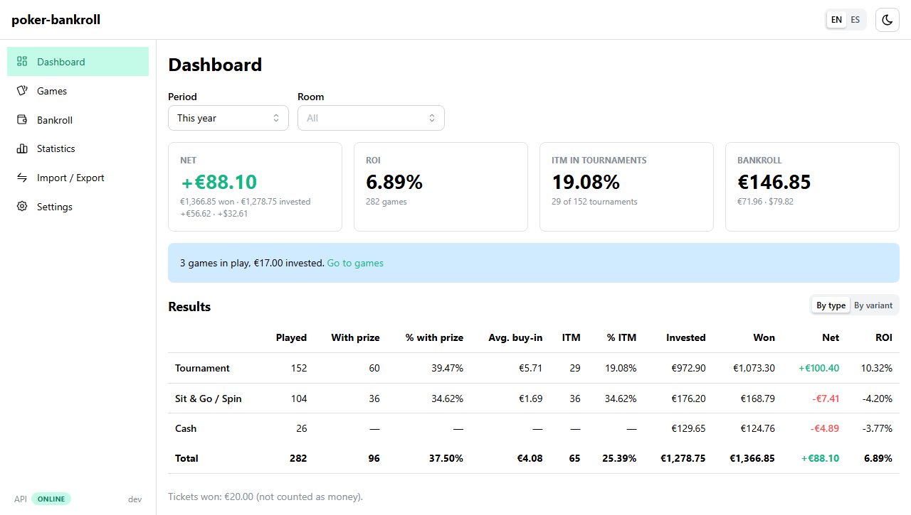
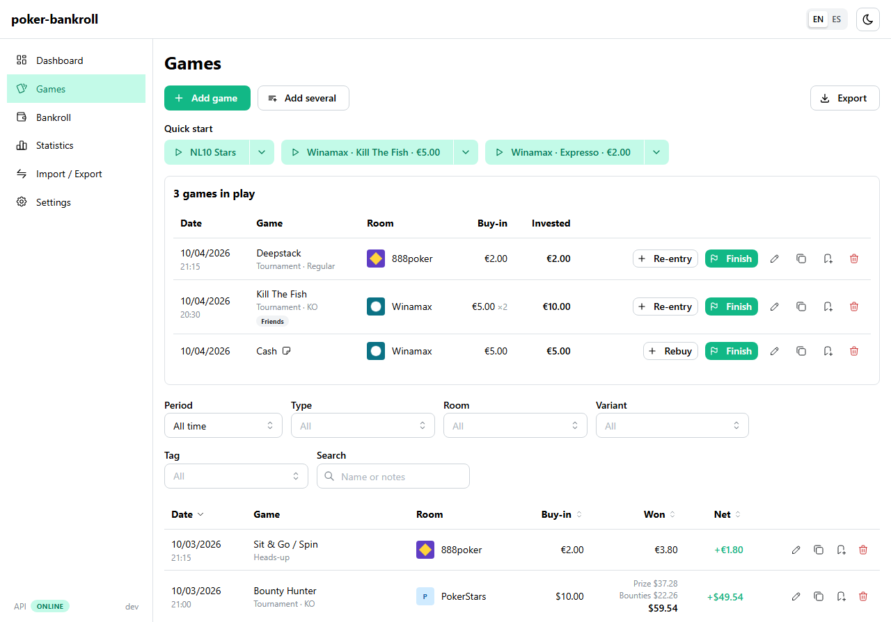
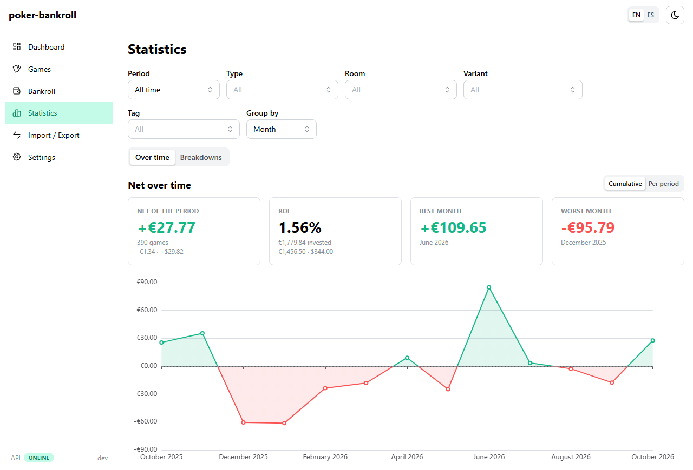
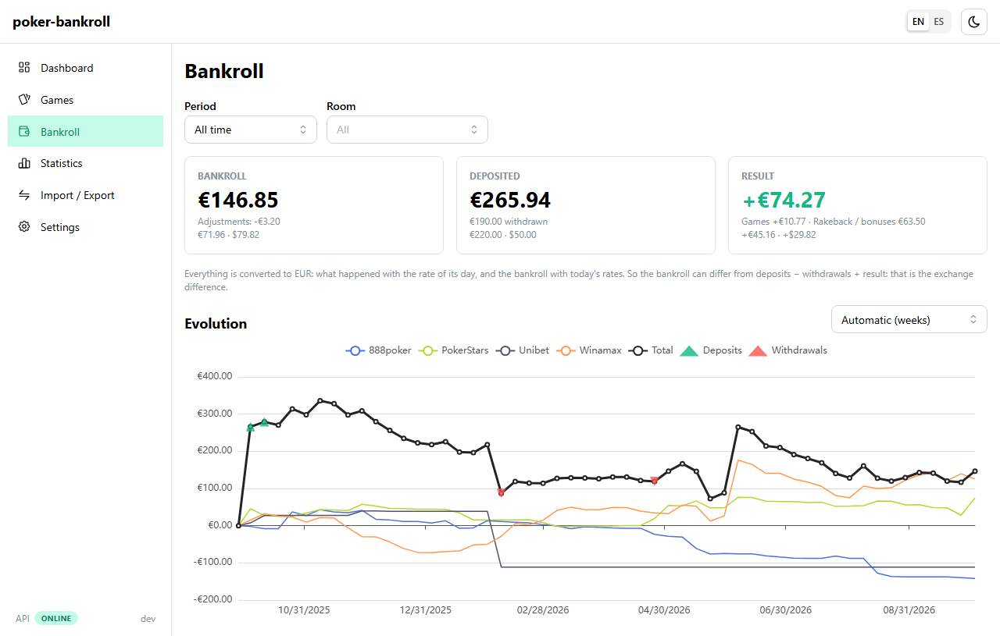
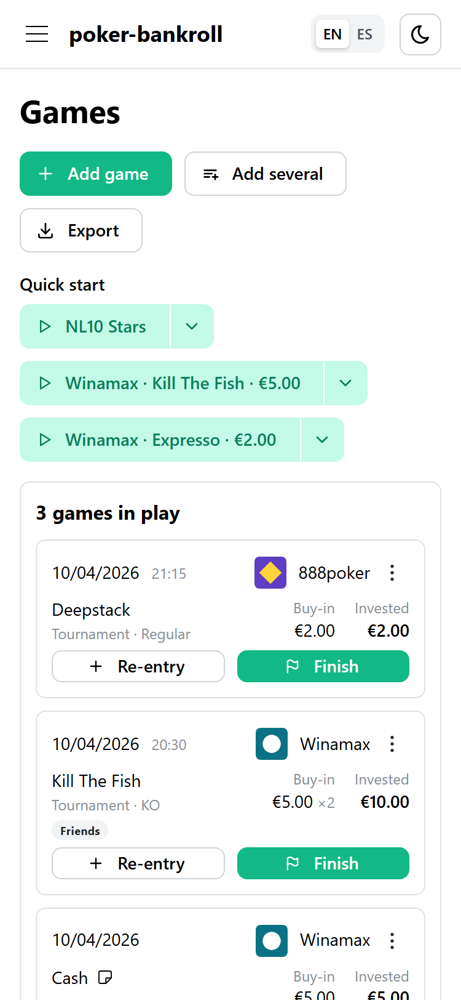

# poker-bankroll

[English](README.md) | **Español**

Gestor de banca de póker autoalojado. Registra los resultados de tus torneos, Sit&Go,
spins y partidas de cash, lleva tu bankroll de póker en cada sala y consulta cómo evolucionan
tus resultados.

> **Estado: primera versión (0.1).** Se puede usar y es joven. Lo que viene después está en las
> [issues](https://github.com/kete1987/poker-bankroll/issues) y en el
> [tablero del proyecto](https://github.com/users/kete1987/projects/3).

## Capturas

Hechas con los [datos de ejemplo](#pruébala-con-datos-de-ejemplo): todos los resultados son
inventados. La interfaz está en inglés; también se puede usar en español.

| Panel | Partidas |
|---|---|
|  |  |
| **Estadísticas** | **Bankroll** |
|  |  |

En el móvil, las listas pasan a ser tarjetas y los filtros se pliegan, así que nada necesita
desplazamiento horizontal:



## Por qué

Muchos jugadores llevan sus resultados en una hoja de cálculo. Funciona hasta que deja de
hacerlo: las fórmulas se rompen, los resúmenes hay que mantenerlos a mano y no se pueden
mezclar monedas. poker-bankroll sustituye esa hoja por una pequeña aplicación que ejecutas
en tu propia máquina.

**No** es un analizador de manos: para eso ya existen herramientas como PokerTracker 4.
Aquí el foco son los resultados y la gestión de la banca.

## Funcionalidades

- Alta rápida de partidas: torneos (re-entries, primas, premios en ticket), Sit&Go y spins
  (Expresso...) y cash, en No-Limit Hold'em o PLO
- Dashboard con resultado neto, ROI e ITM por modalidad
- Resultados por día y por mes, gráfica de evolución
- Bankroll de póker por sala y moneda: depósitos, retiradas, bonos y el resultado de tus partidas
- Varias monedas (EUR y USD de serie, ampliable)
- Interfaz en español e inglés
- Importación de partidas desde un fichero CSV ([formato](docs/import.md), en inglés), para traer tu
  historial de una hoja de cálculo
- Copia de seguridad de todo en un fichero, que se descarga y se restaura desde la aplicación:
  para mudarte a otro equipo o recuperarte de un problema
- Copias de seguridad diarias de la base de datos

Lo que está previsto está en las [issues](https://github.com/kete1987/poker-bankroll/issues).

## Stack

| Parte | Tecnología |
|---|---|
| Base de datos | PostgreSQL 18 |
| Backend | Java 25, Spring Boot 4.1, Flyway, OpenAPI |
| Frontend | React 19, TypeScript 7, Vite 8, Mantine 9, TanStack Query, react-i18next, ECharts |
| Despliegue | Docker Compose (imágenes en GHCR, `amd64` y `arm64`) |

```
navegador ──► web (nginx + SPA) ──/api──► api (Spring Boot) ──► db (PostgreSQL)
```

## Puesta en marcha

Necesitas Docker con Compose:

```bash
git clone https://github.com/kete1987/poker-bankroll.git
cd poker-bankroll/deploy
cp .env.example .env   # pon un POSTGRES_PASSWORD
docker compose up -d   # usa las imágenes publicadas
```

Abre `http://<tu-host>:8080` (el puerto se cambia con `WEB_PORT` en `.env`). Los datos se guardan
en el volumen de Docker `poker-bankroll_db-data`, que se conserva al actualizar el stack.

Las imágenes vienen de GHCR (`linux/amd64` y `linux/arm64`). Se eligen con
`POKER_BANKROLL_VERSION`: `latest` (última versión estable), una serie como `0.1` (solo
correcciones), una versión concreta como `0.1.0`, o `edge` (último merge a `main`).

**Portainer:** crea un stack, pega [`deploy/docker-compose.yml`](deploy/docker-compose.yml) y define
las variables de [`deploy/.env.example`](deploy/.env.example) (al menos `POSTGRES_PASSWORD`, y
`BACKUP_DIR` como ruta absoluta del host).

Para construir las imágenes desde el código:
`docker compose -f docker-compose.yml -f docker-compose.build.yml up -d --build`.

Las versiones, actualizaciones y vueltas atrás se explican en
[docs/releasing.md](docs/releasing.md) (en inglés).

> La aplicación no tiene login. Úsala en tu red local y no la expongas a internet sin
> poner autenticación delante.

### Pruébala con datos de ejemplo

Para ver la aplicación antes de usarla de verdad, arráncala con un año de resultados
**inventados**: cuatro salas, unas 400 partidas, partidas en juego y movimientos de bankroll, nada
real. Solo necesitas Docker con Compose: usa las imágenes publicadas, no se construye nada.

```bash
git clone https://github.com/kete1987/poker-bankroll.git
cd poker-bankroll/deploy
docker compose --env-file demo.env up -d
```

(Sin git, basta con descargar `docker-compose.yml`, `docker-compose.demo.yml` y `demo.env` de
[`deploy/`](deploy) en una misma carpeta.)

Abre `http://localhost:8081` (otro puerto: cambia `WEB_PORT` en `demo.env`). Cuando termines,
tira la demo con sus datos:

```bash
docker compose --env-file demo.env down -v
```

La demo es un proyecto de Compose aparte (`poker-bankroll-demo`, con
[`docker-compose.demo.yml`](deploy/docker-compose.demo.yml) encima de `docker-compose.yml`), con
su propia base de datos, una contraseña de usar y tirar y sin copias de seguridad. No lee `.env`
y nunca toca una instalación real, ni siquiera una en la misma carpeta.

Para ejecutarla desde el código, con la API y la web en modo desarrollo (necesitas JDK 25,
Node 24 y Docker):

```bash
# Terminal 1, desde la raíz del repositorio: API en :8080
cd backend && ./mvnw spring-boot:test-run -Dspring-boot.run.profiles=demo
```

```bash
# Terminal 2, desde la raíz del repositorio: web en :5173
cd frontend && npm ci && npm run dev
```

Los datos de ejemplo solo se cargan en una base de datos vacía, y nunca sin el perfil `demo`: una
instalación real ([Puesta en marcha](#puesta-en-marcha)) siempre empieza con la base de datos vacía.

## Copias de seguridad

El stack hace cada día una copia de la base de datos en `deploy/backups/` (conserva 7 diarias,
4 semanales y 6 mensuales; las variables `BACKUP_*` de `.env` cambian la carpeta, la frecuencia
y la retención). En Portainer, pon en `BACKUP_DIR` una ruta absoluta del host. En
[docs/backups.md](docs/backups.md) (en inglés) se explica cómo hacer una copia en el momento,
restaurarla y llevar las copias a otra máquina.

Además, *Importar / Exportar* en la aplicación descarga una copia de todo en un fichero y la
restaura, también en otra instalación: la forma fácil de mudarte a otro equipo. Mira
[Backup from the app](docs/backups.md#backup-from-the-app) (en inglés).

## Estructura del repositorio

```
backend/    API REST con Spring Boot
frontend/   Aplicación web con React
deploy/     Stack de Docker Compose y configuración de nginx
docs/       Documentación
```

## Contribuir

Las issues y pull requests son bienvenidas. Las convenciones están en
[AGENTS.md](AGENTS.md) (en inglés; aplican también a personas).

## Licencia

[MIT](LICENSE)
